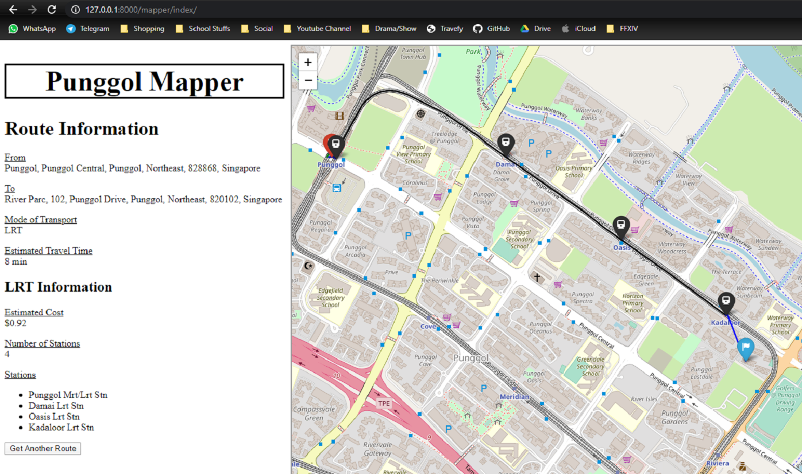

# Punggol Mapper

The goal of this path finder is to provide ease to residents of Punggol in commuting, both easily and swiftly. ‘Punggol Mapper’ ensures that the end users would be able to commute to their destination while traveling at the shortest distance, saving both time and energy moving around.

With SIT moving to its main campus in Punggol sometime in 2023, this path finder aims to help our students to travel around Punggol without difficulties, providing the necessary information needed to travel.

## Dependencies
<table style="width:100%">
  <tr>
    <th>Framework</th>
    <th>Usage</th>
    <th>Source</th>
  </tr>
  <tr>
    <td>OSMnx</td>
    <td>Route Street Networks</td>
    <td>https://github.com/gboeing/osmnx</td>
  </tr>
  <tr>
    <td>Folium</td>
    <td>Generate Map Tiles</td>
    <td>https://python-visualization.github.io/folium/</td>
  </tr>
  <tr>
    <td>Django</td>
    <td>Visualisation of Application</td>
    <td>https://www.djangoproject.com/</td>
  </tr>
</table>

## Installations
The fast and easy way to ensure you have all the dependencies you need to run the program is to download Anaconda from
https://www.anaconda.com/distribution/ for python 3.7 and install it. <br />

Anaconda is a python library and package manager popular for data science, and comes preinstalled with most common python modules used in data science.

Addtionally, install the following packages:
``` In the command line:
conda install django
conda install osmnx
```

## Running The Application
If you installed Anaconda, open Anaconda Prompt, navigate to the project folder 'mapper' and run:
```
python manage.py runserver
```

## How to Use The Application
Access the application with the following:
``` In the browser, go to:
127.0.0.1:8080/mapper/index/
```

In the Main Menu, users are free to enter the start and end address of their choice. They are also allowed to specify a mode of transport. However, do note that only addresses recognised by OpenStreetMap can be used for routing.

Preferred format of addresses are as follow:
<ul>
  <li>For Train Stations: "[Station Code] [Station Name]"</li>
  <li>For Address: "[Block Number] [Street Name] Singapore [Postal Code]"</li>
</ul>

## Demonstrations
### Routing By Walk

### Routing By Drive

### Routing By Bus

### Routing By LRT

